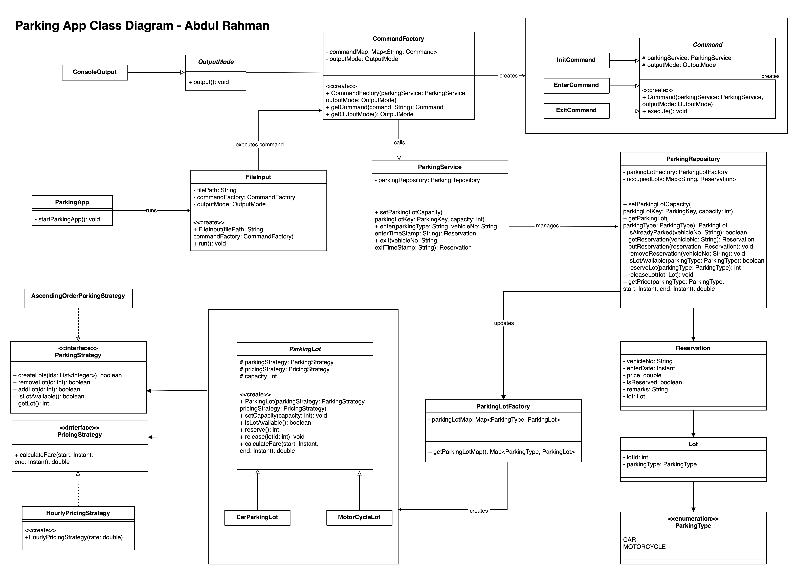

# Parking App

A Parking system app written in Java with command line interface.

##  Project Requirements & Features

- Java 11
- Maven

&nbsp; &nbsp; For Testing

- JUnit 5
- Mockito

### Running App

1. Run the jar file via terminal and pass the input file as argument. Open terminal and run the following snippet

        cd parking-app
        java -jar parking-app.jar valid_input.txt

2. Import the project in your preferred IDE and run the app. Pass the input file as command line argument.

        Positive flow: valid_input.txt
        Negative flow: invalid_input.txt

#### Sample input

    3 4
    Enter motorcycle SGX1234A 1613541902
    Enter car SGF9283P 1613541902
    Exit SGX1234A 1613545602
    Enter car SGP2937F 1613546029
    Enter car SDW2111W 1613549740
    Enter car SSD9281L 1613549740
    Exit SDW2111W 1613559745

The first line creates a `car` parking lot of size `3` and `motorcycle` parking lot of size `4`. The app will throw exception for non-positive values.

`Enter` and `Exit` are command keywords to park and unpark the vehicle. 

`Enter` command is followed by vehicle type (`car` or `motorcycle`), license number and `timestamp` of entering time.

`Exit` command is followed by license number and `timestamp` of exiting time.

#### Sample output

    Accept MOTORCYCLELOT1
    Accept CARLOT1
    MOTORCYCLELOT1 2
    Accept CARLOT2
    Accept CARLOT3
    Reject Parking full
    CARLOT3 6

`Accept` will park the vehicle at the specified lot. The lowest `Lot Id` will be allocated.

`Reject` occurs when parking is full or vehicle is already parked

Upon `Exit`, the lot will be released and fare will be calculated. Parking charges are `$2/hour` for `Car` and `$1/hour` for `Motorcycle`. The hours will be rounded up before calculation.

## System Design

The app follows the Software Engineering SOLID principles and applies the appropriate design pattern where applicable.

### UML Class Diagram

[Parking App Class Diagram Large Image](https://raw.githubusercontent.com/arshrahman/parking-app/main/ParkingAppClassDiagram.png)

## Further Enhancements

- Add Persistence layer
- Add Dependency Injection with framework like Spring
- Add Interactive Command line Input option
- Add Concurrency with Lock to simulate multiple parking lot entrances and exits